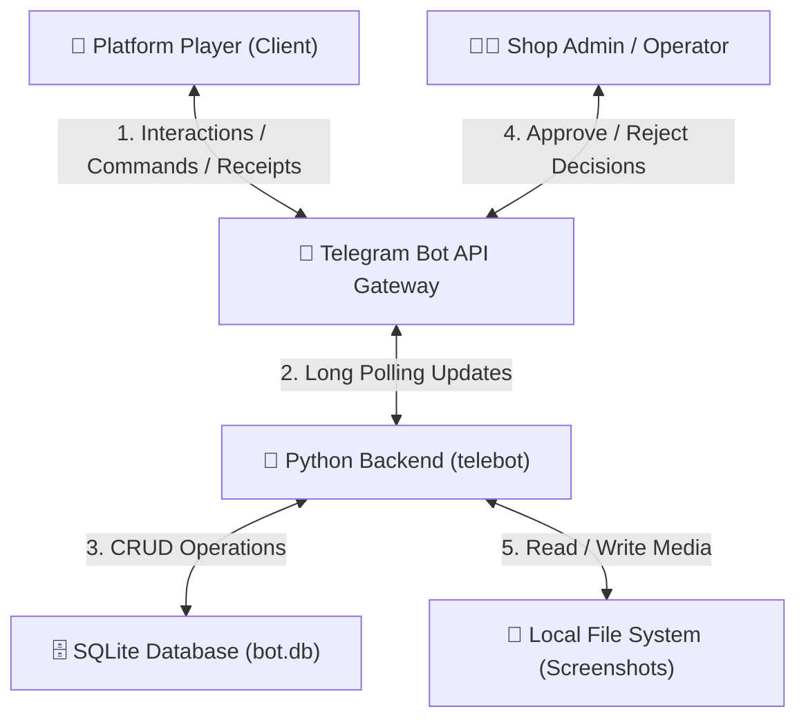
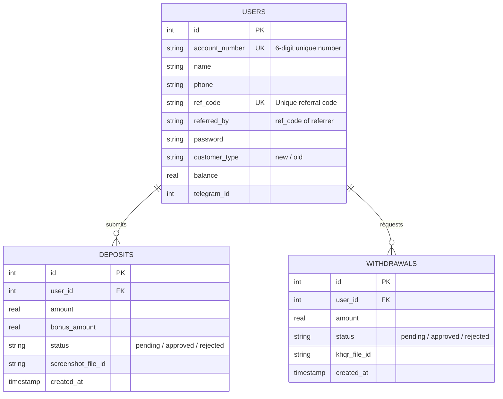

# 🤖 BHK88 Gaming Platform - Deposit, Withdrawal & CRM Bot

Welcome to the **BHK88 Gaming Platform Telegram Bot** repository. This bot is developed as an automated solution to streamline customer registration, manage player wallets, track referral bonuses, and secure deposit/withdrawal transaction verifications.

Players interact with the bot directly via Telegram, while platform administrators receive and approve transaction requests in real time from a dedicated admin chat.

---

## 🚀 Quick Links
* **Live Bot:** [@bhk88gameonline_bot](https://t.me/bhk88gameonline_bot)
* **Project Board:** [GitHub Project Board](https://github.com/orgs/DUC2026-PGB-TechNovaSolutions/projects/1)
* **Team Organization:** [GitHub Organization](https://github.com/DUC2026-PGB-TechNovaSolutions)

---

## 📋 Features

### 👥 F1: Customer (Player) Experience
* **Automated Registration:** Guided workflow asking for the player's name, phone, and optional referral code. Generates a unique 6-digit Account Number, a secure password, and a personal referral code.
* **Secure Session-based Log In:** Players log in with their credentials to access a secure personal Dashboard showing their balance and bonus rates.
* **Organic Referral System:**
  * **Referrer:** Earns a **$1.00** bonus immediately when a referred player signs up.
  * **Referred User:** Receives an elevated **30% deposit bonus** (compared to the default **20%** for new customers and **13%** for old customers).
* **Deposit Requests:** Users input the deposit amount, receive the admin's KHQR payment image, and upload their transaction screenshot for validation.
* **Withdrawal Requests:** Users specify the payout amount and submit their personal KHQR code so admins can transfer the funds.

### 👨‍💼 F2: Admin Operational Experience
* **Real-time Verification Gateway:** All pending deposits and withdrawals are instantly forwarded to the admin chat with the uploaded screenshots or KHQR images.
* **One-Click Inline Actions:** Admins can instantly **Approve ✅** or **Reject ❌** requests directly from the Telegram chat interface.
* **Automated Ledger Updates:** Approving a deposit automatically credits the player's wallet (including their bonus), while approving a withdrawal deducts it, triggering real-time notification receipts to the player.

---

## 🏗️ System Architecture



### Database Schema (SQLite)

The database (`bot.db`) consists of three primary tables to manage user status and financial flows:



---

## 🛠️ Setup & Installation

### 1. Prerequisites
Ensure you have **Python 3.8+** installed on your system.

### 2. Clone the Repository
```bash
git clone https://github.com/DUC2026-PGB-TechNovaSolutions/CRM_bot.git
cd CRM_bot
```

### 3. Install Dependencies
Install all required libraries using `pip`:
```bash
pip install -r requirements.txt
```

### 4. Configuration
Create a local `.env` file in the root directory. You can copy the template from `.env.example`:
```bash
cp .env.example .env
```

Open `.env` and fill in your details:
* **`TELEGRAM_BOT_TOKEN`**: Obtain this by messaging [@BotFather](https://t.me/BotFather) on Telegram and creating a new bot.
* **`ADMIN_CHAT_ID`**: The numeric Telegram ID of the admin user or admin group chat where approval requests will be sent.
  * *Tip:* Message [@userinfobot](https://t.me/userinfobot) on Telegram to find your personal user ID, or add a bot like [@MissRose_bot` to your group chat and type `/id` to get the group ID.
* **`DB_PATH`**: Path to the SQLite database file (defaults to `bot.db`).
* **`ADMIN_KHQR_PATH`**: Filepath to the shop's admin KHQR payment code image (defaults to `adminkhqr.png`).

### 5. Running the Bot
Start the application:
```bash
python bot.py
```
Upon startup, the database schema will automatically initialize if it does not already exist.

---

## 🔒 Security Best Practices

> [!WARNING]
> **Never commit your `.env` file containing active tokens or credentials to Git/GitHub.**
>
> The `.gitignore` file is configured to ignore `.env` and `bot.db` by default. If a `.env` file was committed previously, untrack it using the following commands:
> ```bash
> git rm --cached .env
> git commit -m "Remove .env from repository tracking"
> git push origin main
> ```
