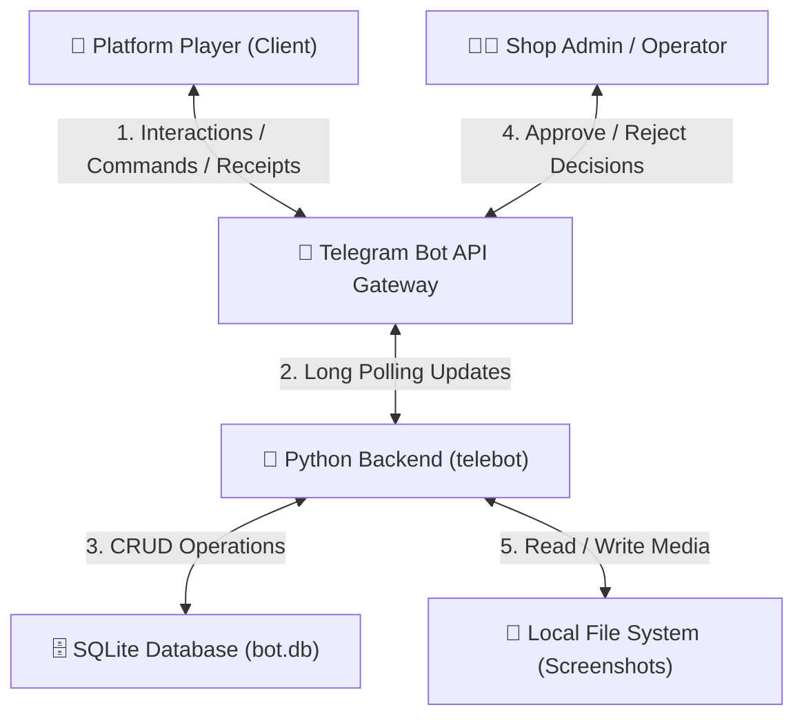
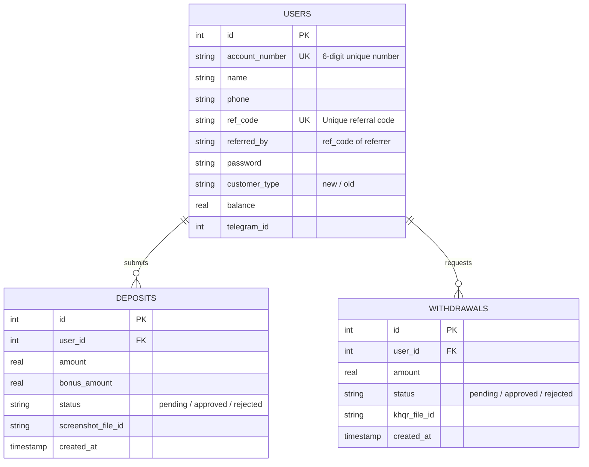

# 🏗️ System Architecture

This page outlines the technical architecture, data model, and state management flow of the BHK88 Gaming Platform Telegram Bot.

## 1. High-Level Architecture Diagram
The system is built on a client-server architecture utilizing the Telegram Bot API as the gateway, a Python backend handling the state machine, and a local SQLite database for persistent storage.

---

## 2. Database Schema (SQLite)
The application utilizes a relational database structure designed to support users, referral relationships, and transactional histories (deposits and withdrawals).

---

## 3. Core Component Roles
* **Telegram Client (UI):** Users interact exclusively through interactive buttons (`InlineKeyboardMarkup`) and text inputs, ensuring sub-2-second response latency.
* **Python Backend (`telebot`):** 
  - Manages session storage for multi-step tasks (e.g., registration steps, deposit/withdrawal creation).
  - Handles thread-safe SQLite connection pools.
  - Implements the FSM (Finite State Machine) using step-handlers.
* **SQLite Database (`bot.db`):** Fast, file-based database handling user profiles, financial balances, and referral links.
* **Admin Approval Gateway:** The bot pushes deposit and withdrawal verification requests directly to the designated `ADMIN_CHAT_ID`. Admins approve or reject transactions using inline buttons, which automatically updates user balances and sends instant notification receipts to the user.